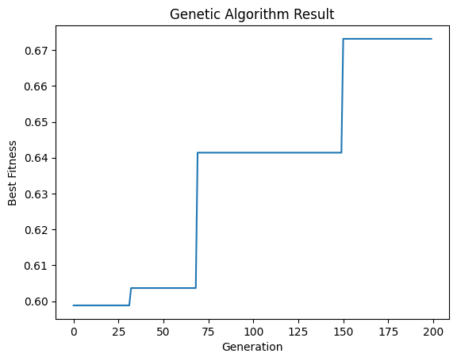

# Basic Genetic Algorithm From Scratch

  

This code calculates the best fitness of the equation below:

$$\leftf(x,y)=(1-x)^2*exp(-x^2-(y+1)^2)-(x-x^3-y^3)*exp((-x^2-y^2))\right$$

Where

$$-2<=x,y<=2$$

## How to run
A Jupyter Notebook software such as Google Colab is required. Copy genetic_ai.ipynb to your Jupyter Notebook software and then run the code.

Elite Selection is enabled by default. You can disable this by setting
  elite_selection=False

Change this variable to set the amount generations the genetic algorithm will run for
  generation=200

You can adjust the fitness equation in the genetic_ai.ipynb provided to find the best fitness of different functions given the variables x and y

Adjust the left and right limits to adjust the range of the decoding function
Increasing the range will decrease the accuracy of the solution
  left_limit = -2.0
  right_limit = 2.0

Adjust the crossover and mutation probability to change how fast each member mutates and crossover with each other within the next generation.
  crossover_prob = 0.7 # probabity of crossover
  mutation_prob = 0.01 # probabity of mutations

## Requirements
- A Jupyter Notebook software such as Google Colab
- Numpy
- Deepcopy
